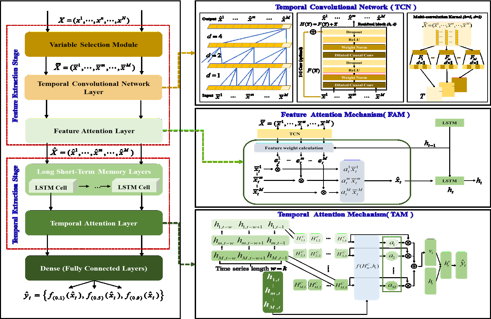
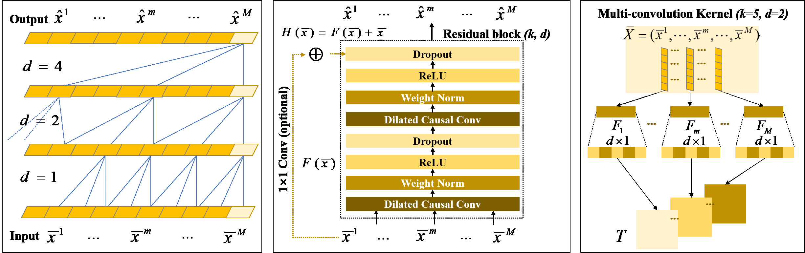
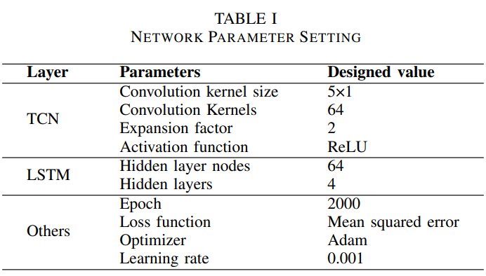
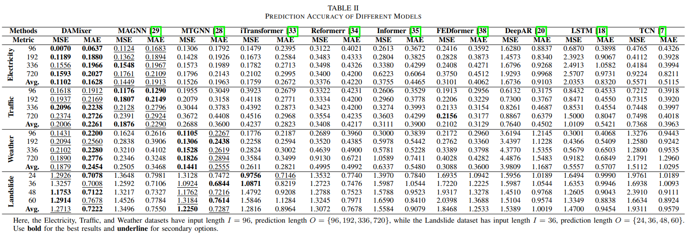
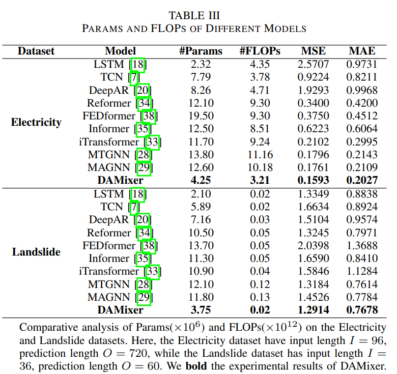
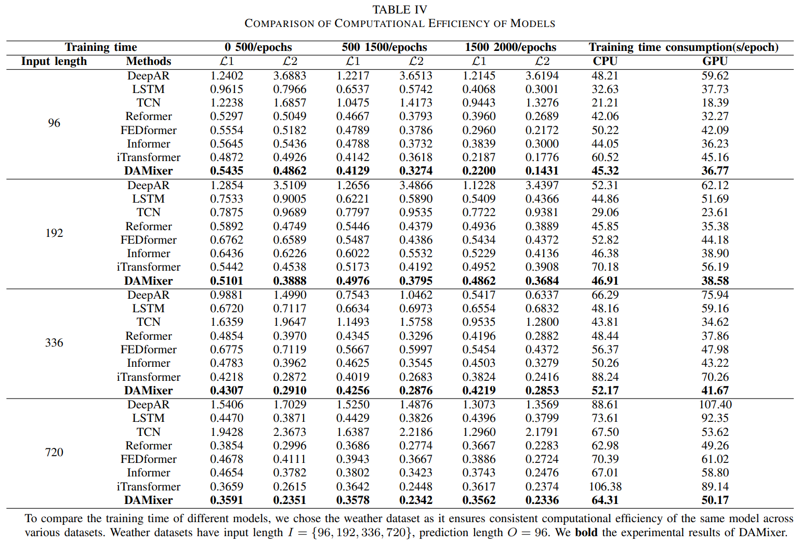
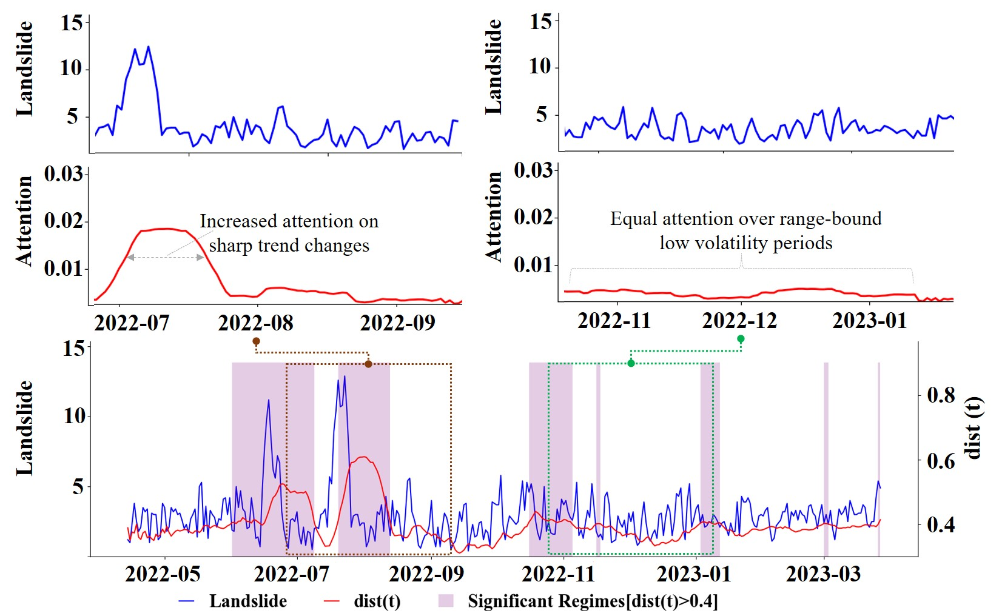
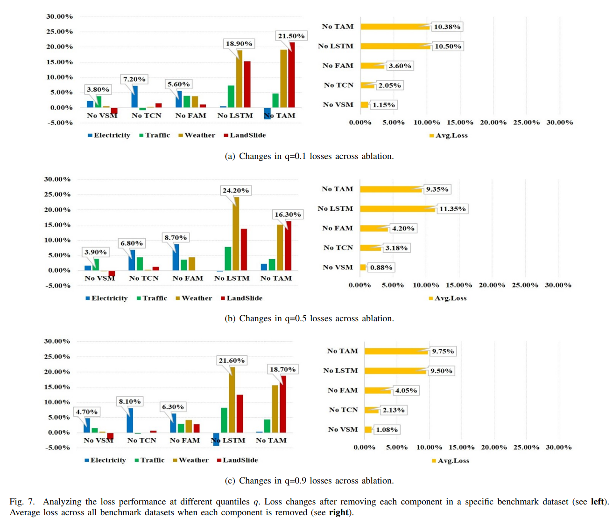
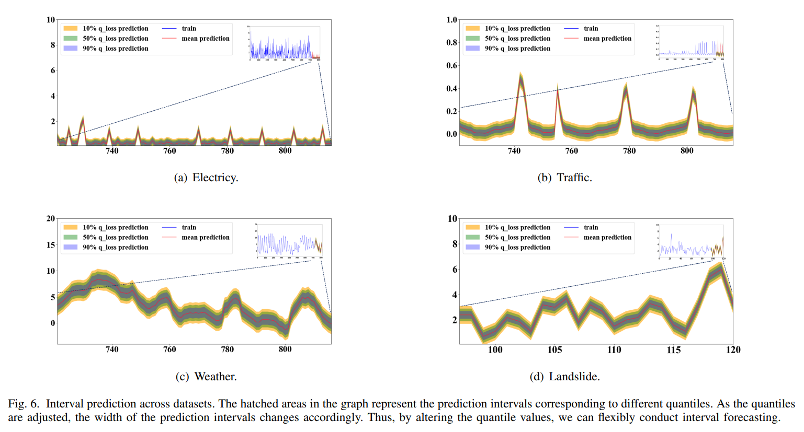

# DAMixer: A Dual-Stage Attention-Based Mixer Model for Multivariate Time Series Forecasting

### Abstract
> To enhance the prediction accuracy, computational
efffciency, and interpretability of time series models, as well
as to address the issues of ineffective time series feature fusion
 caused by feature redundancy and high nonlinearity from
multiple data sources in traditional methods for multivariate
time series, we propose a dual-stage attention-based mixer
model for multivariate time series forecasting, referred to as
DAMixer. This mixer model comprises two stages of attention
mechanisms: feature attention(extracting variable features) and
temporal attention(capturing time patterns). In the ffrst stage,
incorporating a dynamic variable selection module (VSM) and
optimizing the Temporal Convolutional Network (TCN) with
multiple parallel convolutional networks signiffcantly enhances
the capability to extract features from multivariate data while
simultaneously improving computational efffciency in this stage.
Moving to the second stage, based on Long Short-Term Memory
(LSTM), we designed an efffcient temporal attention mechanism
to capture time patterns of different variables. These improvements
 substantially strengthened the performance of the model
in these two critical stages. Concurrently, by monitoring changes
in the temporal attention mechanism, we can identify potential
signiffcant events, thus enhancing the interpretability of prediction
 outcomes. Finally, the output feature vectors are fed into a
fully connected layer, and a quantile loss function is designed to
achieve interval prediction. Experimental results on four distinct
real-world datasets show that, compared to Transformers and
GNNs, DAMixer achieved a reduction of 39.17% and 8.34% in
Mean Squared Error (MSE), and a reduction of 37.44% and
13.60% in Mean Absolute Error (MAE), respectively.

DAMixer architecture integrates two attention mechanisms: Feature attention mechanism (FAM) focuses on feature extraction, overcoming the
heterogeneity challenge of multivariate features. Temporal attention mechanism (TAM) aims to capture time patterns, assisting the model in identifying
signiffcant events (e.g., recognizing landslides during the rainy season).
Finally, the output of the LSTM layer is sent to the fully connected layer, and the target sequence interval prediction is achieved by combining with the quantile loss function.

In the architecture of a TCN, the values of K and d are set to 5 and 2, respectively.

## 2. Training Procedure
### (1) Datasets
To establish a baseline and position related to previous
academic work, we evaluate the performance of the model on
datasets in the ffelds of electricity, trafffc, and weather. Additionally,
 we utilize a self-built landslide monitoring dataset.
Here is a brief description of each dataset.

<b>Electricity</b>: Includes the hourly power consumption of
321 customers from 2012 to 2014, with data points collected
every 15 minutes, documenting the changes in electricity
consumption over three consecutive years.

<b>Traffic</b>: Describes the occupancy rates (between 0 and 1) measured by 862 sensors on San Francisco, California,
freeways. The data were sampled every hour from 2015 to 2016. Following [38], we convert the data to reffect hourly
consumption.

<b>Weather</b>: Provided by the Max Planck Institute for
Biogeochemistry in Germany and records meteorological observation
 data for the city of Jena, Germany. The data includes
multiple meteorological indicators such as temperature, precipitation,
 wind speed, etc., measured at different locations in
Jena by ground stations. These data have been continuously
collected every 10 minutes since 2003.

<b>Landslide</b>: Describes the landslide geological disaster
monitoring data for Yangchan Village in Huangshan City,
China. The data spans from April 2022 to March 2023,
recorded on a daily basis. It belongs to a self-built benchmark
dataset.

### (2) Network Parameter Tuning
Given that the hyperparameters that have a signiffcant
impact on DAMixer network include the convolution kernel
size, activation function, loss function, optimizer, number of
training epochs, learning rate, number of nodes in the hidden
layer, and number of hidden layers, this paper uses crossvalidation
 to ffnd the optimal parameter values that maximize
the model’s generalization performance, as shown in Table I.

### (3) Benchmarks Models
We train benchmark models such as <a href="https://github.com/shangzongjiang/magnn" target="_blank">MAGNN</a>, <a href="https://github.com/nnzhan/MTGNN" target="_blank">MTGNN</a>, <a href="https://github.com/thuml/iTransformer" target="_blank">iTransformer</a>, <a href="https://github.com/jaungiers/LSTM-Neural-Network-for-Time-Series-Prediction" target="_blank">LSTM</a>, <a href="https://github.com/locuslab/TCN" target="_blank">TCN</a>, <a href="https://github.com/husnejahan/DeepAR-pytorch" target="_blank">DeepAR</a>, <a href="https://github.com/lucidrains/reformer-pytorch" target="_blank">Reformer</a>, <a href="https://github.com/MAZiqing/FEDformer/" target="_blank">FEDformer</a>, and <a href="https://github.com/zhouhaoyi/Informer2020" target="_blank">Informer</a> based on the same sample set.
## 3. Model Performance Evaluation and Result Comparison
### (1) Prediction Accuracy
The mean squared error (MSE)
and mean absolute error (MAE) are used as evaluation metrics
for the model testing results. From the model prediction results
statistics shown in Table II, it can be seen that DAMixer
achieves state-of-the-art performance in predicting accuracy
on the four datasets.

### (2) Computational Efficiency
Table III and IV respectively
present a comparative analysis of computational efffciency
for each model parameters (Params), ffoating point operations
(FLOPs), convergence speed, and computational time.
From Table III, it can be seen that Params is not directly
related to the length of the time series data. However, FLOPs
rise with longer time series, implying more computational
resources needed.

From Table III, it can be seen that Params is not directly related to the length of the time series data. However, FLOPs increases with the length of the time series, indicating that processing longer time series requires more computational resources.

From Table IV, we selected the optimal mean absolute error
value (L1 loss) and mean square error value (L2 loss) at each
stage of model training rounds for performance evaluation.

### (3) Model Interpretability
Visualizing time patterns can
help understand the time-dependent relationships present in
a given dataset, such as seasonal, trend, periodic, and random
changes. Examining historical time series unveils akin duration
 patterns, valuable for grasping developmental laws, e.g.,
identifying rainy season landslides.

### (4) Ablation Experiment
To quantify the contribution of
each component in the framework model proposed, we design
ablation experiments, which involve removing each component
one by one and quantifying the accuracy loss of the framework
 model before and after the corresponding component is
removed.

### (5) Interval Prediction
Interval prediction can be performed
using the quantile loss function, and different interval predictions
 can be observed by setting different quantiles (e.g.
0.1, 0.5, and 0.9). The red line in the interval represents
the mean prediction result. In practical applications, selecting
appropriate quantiles based on speciffc situations can help us
better evaluate the uncertainty and risk of prediction results.
Fig. 6 shows the performance of interval prediction at different
quantiles in four benchmark datasets.

## 4. Conclusion
This paper introduces DAMixer, a high-performance mixer
model for predicting multivariate time series. We evaluated
and compared the proposed model using datasets from various
ffelds, leading to the following conclusions.

(1) DAMixer has high computational efffciency and
achieves good results in both computational efffciency
and prediction accuracy when compared to other deep
learning models with equivalent input sample sizes.

(2) The ablation experiment results show that removing
different modules lead to different degrees of loss increase,
 indicating that the model structure optimization
is reasonable.

(3) DAMixer exhibits good interpretability and can accurately
 identify signiffcant events in critical time periods
( e.g., identifying landslides during the rainy season).

Although DAMixer has shown some effectiveness, there is
still room for improvement. Future research direction could
start by decomposing the seasonal trends of time series,
exploring the application potential of DAMixer in more diverse
ffelds.